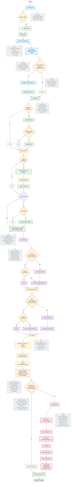

# Flujo de Instalación — Linux

```mermaid
flowchart TD
    classDef prompt fill:#e1f5fe,stroke:#0288d1,stroke-width:2px,color:#000
    classDef check fill:#fff3e0,stroke:#f57c00,stroke-width:2px,color:#000
    classDef install fill:#e8f5e9,stroke:#388e3c,stroke-width:2px,color:#000
    classDef repo fill:#f3e5f5,stroke:#7b1fa2,stroke-width:2px,color:#000
    classDef sync fill:#fff8e1,stroke:#f9a825,stroke-width:2px,color:#000
    classDef personal fill:#fce4ec,stroke:#c62828,stroke-width:2px,color:#000
    classDef skip fill:#f5f5f5,stroke:#9e9e9e,stroke-width:1px,color:#666
    classDef done fill:#e8f5e9,stroke:#2e7d32,stroke-width:2px,color:#000
    classDef note fill:#eceff1,stroke:#90a4ae,stroke-width:1px,color:#555

    start([Inicio]) --> gh_login

    gh_login["GitHub Login"]:::prompt
    gh_login --> gh_check{gh auth valido?}:::check
    gh_check -- Si --> gh_ok[Autenticado]:::done
    gh_check -- No --> gh_auth[gh auth login]:::install
    gh_auth --> gh_ok
    gh_login -.-> gh_note["gh_login():
    Verifica gh auth status.
    Si no hay token valido,
    ejecuta gh auth login."]:::note

    gh_ok --> dev_dir["Directorio de desarrollo"]:::prompt
    dev_dir -.-> dev_note["dev_dir():
    Lee DEVELOPER_DIR del perfil
    o pregunta la ruta.
    Crea el directorio
    si no existe."]:::note

    dev_dir --> comp_sel["Que instalar?
    Gentle AI and Skills
    VSCode"]:::prompt
    comp_sel -.-> comp_note["comp_sel():
    Muestra checklist de
    componentes a instalar.
    Guarda la seleccion
    en el perfil."]:::note

    comp_sel --> backup_check{Config opencode
    existe en
    .config/opencode?}:::check
    backup_check -- Si --> backup_prompt["Respaldar config existente?"]:::prompt
    backup_prompt --> backup_do[Respaldo en backups]:::install
    backup_check -- No --> skip_backup[Fresh install]:::skip
    backup_check -.-> backup_note["backup():
    Si existe config previa,
    pregunta si respaldar.
    Copia a backups/
    con timestamp."]:::note

    backup_do --> install_phase
    skip_backup --> install_phase

    install_phase:::install --> ga_check{Gentle AI
    instalado?}:::check
    install_phase -.-> install_note["install_phase():
    Itera componentes
    seleccionados.
    Cada uno: verifica si
    existe, si no descarga
    e instala."]:::note

    ga_check -- Si --> ga_skip[Skip]:::skip
    ga_check -- No --> ga_install[Instalar Gentle AI]:::install
    ga_install --> skills_check{Gentleman Skills
    instalados?}:::check
    ga_skip --> engram_check

    skills_check -- Si --> skills_skip[Skip]:::skip
    skills_check -- No --> skills_install[Instalar Skills]:::install
    skills_skip --> engram_check
    skills_install --> engram_check

    engram_check:::check --> engram_q{Engram
    instalado?}:::check
    engram_q -- Si --> engram_skip[Skip]:::skip
    engram_q -- No --> engram_dl[Descargar de GitHub Releases]:::install
    engram_dl --> engram_verify[Verificar SHA256]:::check
    engram_verify --> engram_install[Instalar a .local/bin]:::install
    engram_skip --> vscode_q
    engram_install --> vscode_q

    vscode_q{"Instalar VSCode?"}
    vscode_q -- No --> templates
    vscode_q -- Si --> vscode_check{Ya instalado?}:::check
    vscode_check -- Si --> vscode_skip[Skip]:::skip
    vscode_check -- No --> vscode_do[Instalar VSCode apt/dnf]:::install
    vscode_skip --> templates
    vscode_do --> templates

    templates["Copiar templates de agente
    y generar opencode.json"]:::install
    templates -.-> tpl_note["templates():
    Copia templates/ de agente
    desde el package.
    Genera opencode.json con
    skills paths y config
    por defecto."]:::note

    templates --> repo_phase:::repo
    repo_phase -.-> repo_note["repo_phase():
    Crea repos privados en
    GitHub si no existen
    (engram-memories,
    opencode-config).
    Clona localmente o
    hace pull si ya existen."]:::note

    repo_phase --> repo_engram_check{Repo
    engram-memories
    existe en GitHub?}:::check
    repo_engram_check -- Si --> repo_engram_clone_check{Clonado
    localmente?}:::check
    repo_engram_check -- No --> repo_engram_create[Crear repo privado]:::repo
    repo_engram_create --> repo_engram_clone["Clonar a engram-memories"]:::repo
    repo_engram_clone_check -- Si --> repo_engram_pull[git pull]:::repo
    repo_engram_clone_check -- No --> repo_engram_clone
    repo_engram_pull --> repo_opencode_check

    repo_engram_clone --> repo_opencode_check
    repo_opencode_check:::check --> repo_opencode_q{Repo
    opencode-config
    existe en GitHub?}:::check
    repo_opencode_q -- Si --> repo_opencode_clone_check{Clonado
    localmente?}:::check
    repo_opencode_q -- No --> repo_opencode_create[Crear repo privado]:::repo
    repo_opencode_create --> repo_opencode_first_push[Backup inicial de config]:::repo
    repo_opencode_first_push --> sync_phase
    repo_opencode_clone_check -- Si --> repo_opencode_pull[git pull]:::repo
    repo_opencode_clone_check -- No --> repo_opencode_clone["Clonar a opencode-config"]:::repo
    repo_opencode_pull --> sync_phase
    repo_opencode_clone --> sync_phase

    sync_phase:::sync --> sync_setup["Configurar systemd user timers
    cada 30 min"]:::sync
    sync_setup --> sync_engram[Ejecutar sync.sh
    de engram-memories]:::sync
    sync_engram --> sync_config[Ejecutar
    sync-opencode-config.sh]:::sync
    sync_phase -.-> sync_note["sync():
    Configura systemd timers
    para sync automatico
    cada 30 min.
    Ejecuta sync.sh de
    ambos repos."]:::note

    sync_config --> verify["Verificar instalacion:
    Engram en PATH?
    systemd timers activos?
    Repos clonados?"]:::check
    verify -.-> verify_note["verify_installation():
    Verifica engran en PATH,
    gh auth valido,
    timers systemd activos,
    repos clonados.
    Reporta errores
    sin detener."]:::note

    verify --> check_profile{Perfil de Lara
    ya guardado en
    opencode-config?}:::check
    check_profile -.-> profile_note["has_user_profile():
    Busca perfil primero en
    opencode-config/ (sync),
    luego en .config/lara-diaries/.
    Si existe en algun lado,
    salta toda la config."]:::note

    check_profile -- Si --> personal_skip["Saltar configuracion
    (usar perfil existente)"]:::skip

    check_profile -- No --> config_phase:::personal

    config_phase --> repo_mode["Modo repos:
    Auto / Ask / Manual"]:::personal
    repo_mode --> design["Estilo y Design Doc"]:::personal
    design --> mission["Tipo de PC:
    Personal / Trabajo / VM"]:::personal
    mission --> pronouns["Pronombres"]:::personal
    pronouns --> skill["Nivel de informatica"]:::personal
    skill --> assistance["Modo de asistencia"]:::personal
    assistance --> save_profile["Guardar perfil
    y sincronizar a
    opencode-config"]:::personal
    config_phase -.-> config_note["config():
    Solo se ejecuta si NO
    hay perfil existente.
    Pregunta modo repos,
    estilo, tipo de PC,
    pronombres, nivel.
    Guarda perfil y lo
    pushea a opencode-config."]:::note

    personal_skip --> summary
    save_profile --> summary

    summary["Mostrar resumen final"]:::done
    summary --> done([Instalacion completa]):::done
```
