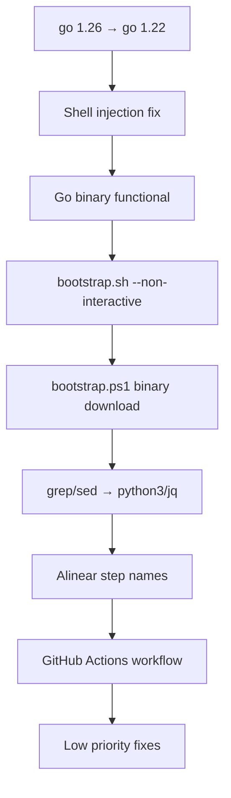

# Tareas Pendientes — Lara Diaries Installer Review

> Generado: 2026-07-02 tras revisión de `feat/standalone-installer-phase-4`

## Resumen Ejecutivo

El repo migró de un bootstrap 100% scripts a una arquitectura híbrida en dos
fases (shell + binario Go). La infraestructura base (state machine, lock,
doctor) está sólida, pero el binario Go es un **esqueleto sin lógica real** y
hay bugs activos de seguridad y regresión funcional.

---

## 🔴 CRITICAL

### 1. Binario Go no instala nada — todos los steps son stubs

**Archivo**: `cmd/lara-installer/install.go`
**Severidad**: CRITICAL — el binario no sirve para instalar

Cada `Run()` function en `install.go` solo printea lo que *haría*:

```go
Run: func() error {
    fmt.Println("  [..] Would clone Gentle AI repository...")
    return nil
},
```

56KB de lógica real en `modules/wizard-core.sh` son completamente inaccesibles.
Si alguien corre `lara-installer install`, avanza 6 pasos sin instalar NADA.

**Fix**: Que cada step de Go shell out a la función correspondiente de
`wizard-core.sh`, o portar la lógica a Go. La opción pragmática es shell out.

---

### 2. `go 1.26` en go.mod — no existe

**Archivo**: `cmd/lara-installer/go.mod`
**Severidad**: CRITICAL — no se puede compilar

```go
go 1.26
```

Go 1.26 no se ha liberado (julio 2026 → lo razonable es go 1.22–1.24).
Cualquier intento de `go build` falla.

**Fix**: Cambiar a `go 1.22` (o la versión estable más antigua que soporte
el código).

---

### 3. Shell injection en `wizard_step_state()` — path de python3

**Archivo**: `modules/wizard-core.sh` — función `wizard_step_state()`
**Severidad**: CRITICAL — seguridad

```bash
python3 -c "
...
step['status'] = '$status'
if '$error_msg':
    step['error'] = '$error_msg'
"
```

Si `$status`, `$step_name` o `$error_msg` contienen una comilla simple (`'`),
el script de Python se rompe o ejecuta código arbitrario. Esto es una
**vulnerabilidad activa** porque estos valores pueden venir del usuario
(nombre de paso, mensaje de error).

**Fix**: Pasar valores por environment variables en vez de interpolación en
string, o usar `jq` para construir el JSON.

---

## 🔴 HIGH

### 4. `--non-interactive` perdido en el nuevo bootstrap.sh

**Archivo**: `bootstrap/bootstrap.sh`
**Severidad**: HIGH — rompe AI-driven install

El `bootstrap.sh` anterior tenía `--check`, `--dry-run`, `--non-interactive
<json>`. El nuevo solo acepta `[install|doctor|--version]`. En el fallback a
`wizard-core.sh`, llama `wizard_main()` que es **interactivo** — un agente AI
que esperaba `--non-interactive` ahora se cuelga esperando input humano.

**Fix**: Restaurar el parsing de flags. Si `--non-interactive` está presente y
se cae al fallback, pasar el JSON a `wizard_noninteractive()`.

---

### 5. Windows nunca usa el binario Go

**Archivo**: `bootstrap/bootstrap.ps1`
**Severidad**: HIGH — la mitad de la arquitectura no funciona en Windows

`bootstrap.ps1` fue reescrito como thin wrapper pero **nunca verifica si el
binario existe localmente ni lo descarga**. Windows siempre cae al wizard
PowerShell, nunca puede ejecutar `lara-installer.exe`.

**Fix**: Implementar en PowerShell el mismo patrón que `bootstrap.sh`:
verificar `Get-BinaryPath`, descargar con `Invoke-WebRequest`, verificar SHA256,
`exec` o fallback.

---

### 6. Sin GitHub Actions para build + release del binario

**Archivo**: inexistente (faltaría `.github/workflows/release-installer.yml`)
**Severidad**: HIGH — nadie puede obtener el binario

`bootstrap.sh` descarga de:
```
https://github.com/orlinefoster/lara-diaries/releases/latest/download/lara-installer-linux-amd64
```

Pero no hay CI/CD que compile, firme, genere checksums y suba los binarios
para las 4 plataformas objetivo.

**Fix**: Crear workflow que buildée para `linux/{amd64,arm64}`,
`darwin/{amd64,arm64}`, `windows/amd64`, genere `*.sha256`, y suba a
GitHub Releases.

---

## 🟡 MEDIUM

### 7. `wizard_step_is_done()` usa grep/sed sobre JSON

**Archivo**: `modules/wizard-core.sh`
**Severidad**: MEDIUM — falsos positivos en resume

```bash
status="$(grep -A5 "\"$step_name\"" "$state_file" | grep '"status"' | sed '...')"
```

Si el nombre de un step aparece como substring en otro campo del JSON, el
grep matchea el paso equivocado. Debe usar python3 o jq para parseo exacto.

---

### 8. Nombres de steps divergentes Go vs Shell

**Archivos**: `cmd/lara-installer/install.go` vs `modules/wizard-core.sh`
**Severidad**: MEDIUM — state.json no portable entre runtimes

| Go steps | Shell steps |
|---|---|
| `github_login` | `github_login` ✅ |
| `clone_gentle_ai` | — |
| `setup_gentleman_skills` | — |
| `setup_engram` | — |
| `setup_opencode` | — |
| `setup_vscode` | — |
| — | `dev_directory` |
| — | `recognition_questions` |
| — | `repo_management` |
| — | `design_orientation` |
| — | `mission` |
| — | `install_components` |
| — | `setup_sync` |
| — | `save_profile` |
| — | `show_summary` |

Solo 1 de 15 pasos coincide. Si se alterna entre Go y shell, el state.json
es inservible.

**Fix**: Alinear los steps. Opción pragmática: que el Go binary llame a
funciones shell y use los mismos nombres.

---

### 9. `bootstrap.ps1` arranca con BOM UTF-8

**Archivo**: `bootstrap/bootstrap.ps1`
**Severidad**: MEDIUM — problemas en PowerShell 5.1 sin BOM

El diff muestra `#!/usr/bin/env pwsh` — el BOM `U+FEFF` al inicio puede
causar problemas de parsing en PowerShell 5.1 en algunas configuraciones.
Además, `#!/usr/bin/env pwsh` es un shebang de Unix que PowerShell ignora
en Windows pero confunde en editors.

---

### 10. Test `TestDoctorResult_StatusValues` llama función inexistente

**Archivo**: `cmd/lara-installer/doctor_test.go`
**Severidad**: MEDIUM — no compila (además de go 1.26)

```go
result := runDoctorChecks()
```

`runDoctorChecks()` no existe como función exportada en `doctor.go`. El test
no compila.

---

### 11. Sin rollback de pasos ya completados

**Archivo**: `cmd/lara-installer/install.go`
**Severidad**: MEDIUM — UX de recuperación limitada

Si el paso 3 falla y hace rollback de sí mismo, los pasos 1-2 quedan como
`success` en state.json. No hay un mecanismo para "undo" completo. En el
shell tampoco hay rollback de pasos anteriores.

---

## 🟢 LOW

### 12. `wizard_step_state()` sobrescribe `started_at`

**Archivo**: `modules/wizard-core.sh`
**Severidad**: LOW — pérdida de datos de timing

Cada llamada setea `started_at = $now`, incluso cuando el paso ya está
corriendo y se está marcando como `success`. Go lo hace bien a través de
`UpdateStep`.

**Fix**: Solo setear `started_at` si no existe o si el status es `running`.

---

### 13. `LockFile()` está en `state.go` en vez de `lock.go`

**Archivo**: `cmd/lara-installer/state.go`
**Severidad**: LOW — estilo/código

La función `LockFile()` está definida en `state.go` (líneas 83-85) en vez de
en `lock.go` donde estaría más natural. No afecta funcionalidad.

---

### 14. Doctor no tiene self-check

**Archivo**: `cmd/lara-installer/doctor.go`
**Severidad**: LOW

Verifica `git`, `gh`, state file, lock file — pero no verifica su propia
integridad (checksum del binario, versión embebida, permisos de ejecución).

---

### 15. Sin flag `--help`

**Archivo**: `cmd/lara-installer/main.go`
**Severidad**: LOW

`lara-installer --help` cae al default con "Unknown command". Típicamente
`--help` y `-h` deberían mostrar el usage.

---

## Prioridad de Corrección



Orden de implementación sugerido:

| # | Tarea | Archivo | Esfuerzo | Estado |
|---|-------|---------|----------|--------|
| 1 | `go 1.26` → `go 1.22` | `go.mod` | 1 min | ✅ |
| 2 | Shell injection en wizard_step_state | `wizard-core.sh` | 15 min | ✅ |
| 3 | grep/sed → python3/jq en wizard_step_is_done | `wizard-core.sh` | 10 min | ✅ |
| 4 | started_at no sobrescribir | `wizard-core.sh` | 5 min | 🔲 ya cubierto por python3 path |
| 5 | `--non-interactive` en bootstrap.sh | `bootstrap.sh` + `wizard-core.sh` | 20 min | ✅ |
| 6 | bootstrap.ps1 flags + --non-interactive | `bootstrap.ps1` | 30 min | ✅ (binary download ya existía) |
| 7 | Go binary funcional (shell out) | `install.go` + `wizard-core.sh` | 45 min | ✅ |
| 8 | Test `runDoctorChecks` inexistente | `doctor_test.go` | 5 min | ✅ |
| 9 | GitHub Actions workflow | `.github/workflows/release-installer.yml` | 30 min | ✅ |
| 10 | `--help` flag | `main.go` | 5 min | ✅ |
| 11 | Doctor self-check | `doctor.go` | 10 min | ✅ |
| 12 | Full undo | `install.go` | 20 min | ⏳ |
| 13 | LockFile() mover a lock.go | refactor | 5 min | ❌ estilo menor |
| 14 | BOM UTF-8 en bootstrap.ps1 | `bootstrap.ps1` | 2 min | ✅ |
