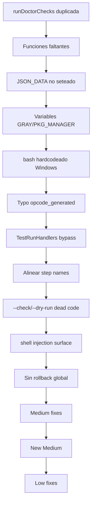

# Tareas Pendientes — Lara Diaries Full Audit

> Generado: 2026-07-02 tras auditoría completa del proyecto (25+ archivos)
> Fuente: auditoría orquestada vía `sdd-explore`

## Resumen Ejecutivo

**30 issues encontrados**: 7 🔴 CRITICAL · 4 🔴 HIGH · 13 🟡 MEDIUM · 6 🟢 LOW

Del `tareas-pendientes.md` anterior (14 items de la review de `feat/standalone-installer-phase-4`), 11 estaban marcados ✅ pero la auditoría reveló que **2 de esos fix están rotos** (items 8 y 10). Este documento unifica todo y agrega los hallazgos nuevos de dos auditorías posteriores (H4, M9, y 8 issues nuevos encontrados en la segunda auditoría).

---

## 🔴 CRITICAL — Bugs que rompen funcionalidad

### C1. `runDoctorChecks()` definida dos veces → no compila

**Archivo**: `cmd/lara-installer/doctor.go:18` + `cmd/lara-installer/doctor_test.go:198`
**Severidad**: CRITICAL — `go test` falla

`doctor.go:18` define `runDoctorChecks()` como función del package (con `doctorSelfCheck`).
`doctor_test.go:198` define OTRO `runDoctorChecks()` en el test file.

Go no permite dos funciones con el mismo nombre en el mismo package, incluso en test files.

**Fix**: Eliminar la función duplicada en `doctor_test.go`. El test debe llamar a la función real de `doctor.go`.

---

### C2. `run_go_step()` llama 3 funciones que no existen

**Archivo**: `modules/wizard-core.sh` líneas 1401, 1414, 1419
**Severidad**: CRITICAL — Go binary no puede instalar Engram ni configurar opencode

Cuando el Go binary ejecuta steps vía `run_go_step()`, llama a:

| Step | Line | Función llamada | ¿Existe? |
|------|------|-----------------|----------|
| `setup_engram` | 1401 | `install_engram` | ❌ — la lógica está inlined en `install_components()` |
| `setup_opencode` | 1414 | `generate_opencode_json` | ❌ — nunca definida |
| `setup_opencode` | 1419 | `copy_agent_templates` | ❌ — nunca definida |

**Fix**: Extraer esas funciones de su contexto inline o definirlas como funciones independientes en `wizard-core.sh`.

---

### C3. JSON config del Go binary es completamente ignorado

**Archivo**: `modules/wizard-core.sh` — `run_go_step()` (línea 1325) y `get_json_val()` (línea 1199)
**Severidad**: CRITICAL — flag `--config` del Go binary no tiene efecto

`run_go_step()` recibe el JSON en `$json_config` (arg o `LARA_JSON_CONFIG`), pero `get_json_val()` lee de `$JSON_DATA`:

```bash
python3 -c "..." <<< "$JSON_DATA"   # ← usa $JSON_DATA, no stdin
```

Y `$JSON_DATA` **nunca se setea** dentro de `run_go_step()` — solo se setea en `wizard_noninteractive()` (línea 1212). Todas las variables resuelven a su default.

**Fix**: Setear `JSON_DATA="$json_config"` al inicio de `run_go_step()`, antes de usarlo.

---

### C4. `${GRAY}` y `${PKG_MANAGER}` — variables sin definir rompen wizard con `set -u`

**Archivo**: `modules/wizard-core.sh` líneas 667, 787, 821, 846
**Severidad**: CRITICAL — wizard aborta inmediatamente

El script usa `set -euo pipefail` (nounset activo), pero:

- `${GRAY}` se usa en 3 líneas (667, 821, 846) pero **nunca se declara** — solo existen `GREEN`, `YELLOW`, `RED`, `CYAN`, `BOLD`, `RESET`
- `${PKG_MANAGER}` se usa en línea 787 pero **nunca se define**

**Fix**: Agregar `GRAY` a las declaraciones de color. Detectar `PKG_MANAGER` con `command -v` o darle un default.

---

### C5. Go binary hardcodea `bash` — no funciona en Windows

**Archivo**: `cmd/lara-installer/install.go` línea 50
**Severidad**: CRITICAL — cross-compile para Windows es inservible

```go
cmd := exec.Command("bash", "-c", "source '"+wizardPath+"' && run_go_step '"+stepName+"'")
```

El CI compila para `windows/amd64`, pero en Windows no hay `bash` disponible por defecto. El binario no puede ejecutar ningún step.

**Fix**: Detectar plataforma. En Windows: usar `powershell` o `pwsh` en vez de `bash`, o leer el wizard y ejecutar los pasos directamente en Go.

---

### N1. Typo en `generate_opencode_json()` — variable `$opcode_generated` en vez de `$opencode_generated`

**Archivo**: `modules/wizard-core.sh` línea 880
**Severidad**: CRITICAL — todo usuario del shell wizard obtiene opencode.json con placeholders literales

`generate_opencode_json()` (creada como parte del fix de C2) setea `opencode_generated=true` en línea 861 (python3) o 877 (jq), pero la condición en línea 880 lee `$opcode_generated` (falta "en"). Siempre evalúa false, cae al fallback que copia el template con `{{ENGRAM_PATH}}` literal.

```bash
local opencode_generated=false    # línea 821 — correcto
..." && opencode_generated=true   # línea 861 — correcto
if [[ "$opcode_generated" == "true" ]]; then  # línea 880 — TYPO
```

**Fix**: Cambiar `$opcode_generated` a `$opencode_generated` en la línea 880.

---

### N2. `TestRunHandlers_Execute` llama `step.Run("", "")` sin pasar por `standaloneRun`

**Archivo**: `cmd/lara-installer/install_test.go` líneas 149-160
**Severidad**: CRITICAL — test siempre falla en CI con Go

El test llama `step.Run("", "")` esperando que ejecute `standaloneRun`, pero ese switch está en `runInstall()` (línea 288-295), no dentro de `step.Run`. El `Run` closure siempre llama `shellOut(wizardPath, ...)` con path vacío → falla.

**Fix**: Reestructurar el test para que ejecute `runInstall()` o mock el shellOut.

---

## 🔴 HIGH — Features que no funcionan como se espera

### H1. Step names completamente divergentes — `state.json` incompatible

**Archivos**: `cmd/lara-installer/install.go` vs `modules/wizard-core.sh` vs `modules/wizard-core.ps1`
**Severidad**: HIGH — resume roto entre runtimes

Solo **1 de 17** step names coincide entre Go, shell wizard y PS wizard.

| Go binary (6) | Shell wizard (10) | PS wizard (11) |
|--------------|-------------------|----------------|
| `github_login` ✅ | `github_login` ✅ | `github_login` ✅ |
| `clone_gentle_ai` | — | — |
| `setup_gentleman_skills` | — | — |
| `setup_engram` | — | — |
| `setup_opencode` | — | — |
| `setup_vscode` | — | — |
| — | `dev_directory` | `dev_directory` |
| — | `gentle_ai` | `gentle_ai_prompt` |
| — | `recognition` | `recognition_questions` |
| — | `repo_management` | `repo_management` |
| — | `design_orientation` | `design_orientation` |
| — | `mission` | `mission` |
| — | `install_components` | `install_components` |
| — | `setup_sync` | `setup_sync` |
| — | `save_profile` | — |
| — | `show_summary` | `show_summary` |
| — | — | `backup` |

**Fix**: Alinear los nombres. El Go binary debe usar los mismos nombres que el shell wizard. Opción pragmática: que el Go binary mapee a los nombres shell.

---

### H2. `--check` y `--dry-run` en `bootstrap.sh` llaman funciones inexistentes

**Archivo**: `bootstrap/bootstrap.sh` líneas 156-168
**Severidad**: HIGH — flags existen pero son dead code

```bash
if type wizard_check_only &>/dev/null 2>&1; then   # NUNCA definida
    wizard_check_only
else
    echo "Check mode not available in script fallback."   # SIEMPRE imprime esto
fi
```

Tanto `wizard_check_only` como `wizard_dry_run` no existen en `wizard-core.sh`.

**Fix**: Implementar ambas funciones en `wizard-core.sh`.

---

### H3. Shell injection surface en `shellOut()` de Go binary

**Archivo**: `cmd/lara-installer/install.go` línea 50
**Severidad**: HIGH — seguridad

```go
cmd := exec.Command("bash", "-c", "source '"+wizardPath+"' && run_go_step '"+stepName+"'")
```

Si `wizardPath` contiene una comilla simple (e.g., `/home/user/lara's/...`), hay command injection. Bajo riesgo porque los paths vienen del código, pero el patrón es inseguro.

**Fix**: Pasar `wizardPath` como argumento a bash y usar `$1` dentro del script, o sanitizar el path.

---

### H4. Sin rollback global — pasos completados no se deshacen si falla otro

**Archivos**: `cmd/lara-installer/install.go`, `modules/wizard-core.sh`
**Severidad**: HIGH — instalación parcial deja sistema sucio sin undo

Cada paso tiene rollback individual (ej: `rollback_remove_dir`, `rollbackShell`).
Pero si el paso 3 falla, los pasos 1-2 siguen marcados como `success` en
`state.json` y sus cambios **no se revierten**. No hay un "undo completo" que
vuelva al estado pre-instalación.

```go
// install.go: cada step tiene su propio rollback, pero si falla el 3,
// los steps 1-2 ya se marcaron como success y no se tocan
```

**Fix**: Implementar `undo_all()` que:
1. Lea `state.json` y recorra steps en orden inverso
2. Ejecute el rollback de cada step completado
3. Elimine `state.json` al final (o marque como `rolled_back`)
4. Informe al usuario qué se deshizo y qué no

---

## 🟡 MEDIUM — Inconsistencias, paridad incompleta

### M1. No hay backup step en shell wizard (PowerShell sí tiene)

**Archivo**: `modules/wizard-core.sh`
**Severidad**: MEDIUM

`wizard-core.ps1` tiene `Backup-ExistingConfig` e `Invoke-BackupPrompt` que respaldan `opencode.json`, AGENTS.md, agents, plugins, commands, skills. `wizard-core.sh` no tiene equivalente.

**Fix**: Implementar backup de configuración existente en `wizard-core.sh`.

---

### M2. `bootstrap.ps1` hardcodea Windows amd64 solamente

**Archivo**: `bootstrap/bootstrap.ps1` línea 19
**Severidad**: MEDIUM

```powershell
function Get-BinaryName {
    return "lara-installer-windows-amd64.exe"
}
```

No soporta Windows ARM64. `bootstrap.sh` detecta dinámicamente `uname -m`.

**Fix**: Detectar arquitectura en PowerShell con `$env:PROCESSOR_ARCHITECTURE`.

---

### M3. CI referencia `go.sum` que no existe

**Archivo**: `.github/workflows/release-installer.yml` línea 62
**Severidad**: MEDIUM

```yaml
cache-dependency-path: cmd/lara-installer/go.sum
```

El módulo Go tiene cero dependencias externas — `go.sum` nunca se genera.

**Fix**: Cambiar a `cmd/lara-installer/go.mod` o eliminar el `cache-dependency-path`.

---

### M4. Archivos documentados en `design.md` que no existen

**Archivo**: `design.md` sección 4
**Severidad**: MEDIUM

`docs/ARCHITECTURE_DECISIONS.md` y `docs/TROUBLESHOOTING.md` están listados pero nunca fueron creados. El directorio `docs/` solo contiene `installer-state-schema.md` que NO está listado.

**Fix**: Crear los archivos faltantes o actualizar `design.md`.

---

### M5. Archivos existen pero no están documentados en `design.md`

**Archivos**: varios
**Severidad**: MEDIUM

| Archivo | ¿En design.md? |
|---------|---------------|
| `bootstrap/bootstrap.Tests.ps1` | ❌ |
| `cmd/lara-installer/` (directorio completo) | ❌ |
| `.github/workflows/release-installer.yml` | ❌ |
| `tareas-pendientes.md` | ❌ |
| `docs/installer-state-schema.md` | ❌ |

**Fix**: Actualizar `design.md` con la estructura actual del proyecto.

---

### M6. Fresh-state path en `wizard_step_state()` sigue interpolando en JSON

**Archivo**: `modules/wizard-core.sh` líneas 488-507
**Severidad**: MEDIUM

El python3 path (líneas 446-484) usa env vars correctamente. Pero el fresh-state fallback (cuando no existe `state.json`) sigue usando interpolación directa:

```bash
'"${error_msg:-null}"'   # se rompe si error_msg contiene "
```

**Fix**: Usar el mismo patrón de env vars en el fresh-state path.

---

### M7. PowerShell wizard no genera `opencode.json`

**Archivo**: `modules/wizard-core.ps1`
**Severidad**: MEDIUM

El shell wizard (`wizard-core.sh`) genera `opencode.json` reemplazando placeholders. El PS wizard solo copia templates — los usuarios de Windows obtienen placeholders literales `{{ENGRAM_PATH}}`, `{{GIT_COMMIT_LEVEL}}`, etc.

**Fix**: Implementar generación de `opencode.json` en `wizard-core.ps1`.

---

### M8. Temp file leak en generación fallida de `opencode.json`

**Archivo**: `modules/wizard-core.sh` línea 914
**Severidad**: MEDIUM

`/tmp/opencode-$$.json` se crea para la generación de config. Solo se limpia en éxito (vía `mv`). Si falla, queda en `/tmp`.

**Fix**: Agregar `trap` o cleanup explícito en el path de error.

---

### M9. `doctorSelfCheck` incompleto — falta checksum e integridad de archivos

**Archivo**: `cmd/lara-installer/doctor.go:188`
**Severidad**: MEDIUM

`doctorSelfCheck()` existe y verifica:
- Path del ejecutable (`os.Executable()`)
- Tamaño del binario (no vacío)
- Versión embebida

Pero **no verifica**:
- Checksum SHA256 del binario (para detectar corrupción)
- Integridad de los archivos que instaló (están todos? están completos?)
- Que los checksums de los assets instalados coincidan con lo esperado

```go
func doctorSelfCheck() doctorCheck {
    // Verifica size > 0, pero no checksum
    // No verifica archivos instalados
}
```

**Fix**: Agregar al doctor:
1. Calcular SHA256 del binario y compararlo con un checksum embebido en el build
2. Verificar que existan los archivos clave que el installer debió dejar (opencode.json, agent prompts, etc.)
3. Opcional: checksum de esos archivos

---

### N3. CI build escribe a `../../release/` pero el directorio puede no existir

**Archivo**: `.github/workflows/release-installer.yml` línea 71
**Severidad**: MEDIUM — CI pipeline falla en tag push

El job `build` ejecuta `go build -o "../../release/$BINARY_NAME" .` pero `go build -o` no crea directorios padres. El `mkdir -p release` está en el job `release` (separado, línea 100). Si `release/` no existe en el checkout, el build falla.

**Fix**: Agregar `mkdir -p release` antes del `go build` en el job `build`.

---

### N4. PS wizard Engram download detecta mal ARM64 en Windows

**Archivo**: `modules/wizard-core.ps1` línea 736
**Severidad**: MEDIUM — Windows ARM64 descarga binario x86

Usa `[Environment]::Is64BitOperatingSystem` que retorna `$true` tanto para x64 como ARM64. `bootstrap.ps1` (línea 19) lo hace correctamente con `$env:PROCESSOR_ARCHITECTURE`.

```powershell
# Mal: ambos x64 y ARM64 dan true
$arch = if ([Environment]::Is64BitOperatingSystem) { "amd64" } else { "arm64" }

# Bien:
$arch = if ($env:PROCESSOR_ARCHITECTURE -eq 'ARM64') { "arm64" } else { "amd64" }
```

**Fix**: Reemplazar la detección con `$env:PROCESSOR_ARCHITECTURE`.

---

### N5. `doctor_test.go` asume que `go` está disponible en PATH

**Archivo**: `cmd/lara-installer/doctor_test.go` líneas 176-186
**Severidad**: MEDIUM — test flaky en distintos entornos

`TestCheckPrereq_Found` usa `checkPrereq("go")` y espera `"OK"`. En sistemas sin Go (CI de release, entornos limpios), el test falla.

```go
// go should always be in PATH during tests  ← incorrecto
c := checkPrereq("go")
```

**Fix**: Usar un comando que SÍ existe siempre (como `sh` o un mock), o verificar con subtests separados.

---

## 🟢 LOW — Estilo, mínimos

### L1. `LockFile()` está en `state.go` en vez de `lock.go`

**Archivo**: `cmd/lara-installer/state.go:80`
**Severidad**: LOW

La función está en `state.go` (líneas 83-85) en vez de `lock.go`. No afecta funcionalidad.

---

### L2. Standalone mode: steps `setup_engram` y `setup_opencode` son no-ops

**Archivo**: `cmd/lara-installer/install.go` líneas 346-350
**Severidad**: LOW

En standalone mode (sin `wizard-core.sh`), estos steps imprimen un mensaje de instalación manual pero retornan `nil` (success). El instalador "completa exitosamente" sin instalar nada.

**Fix**: Retornar error explicativo en vez de success silencioso.

---

### L3. `tareas-pendientes.md` item 8 marcado ✅ pero steps siguen divergentes

**Severidad**: LOW — tracking accuracy

El item 8 (step names) se marcó como ✅ porque el Go binary empezó a usar `run_go_step()`, pero los nombres siguen siendo incompatibles con el shell wizard. El state.json no es portable.

---

### L4. `tareas-pendientes.md` item 10 marcado ✅ pero `runDoctorChecks` está duplicado

**Severidad**: LOW — tracking accuracy

El fix de `runDoctorChecks` introdujo una función duplicada en el test file, rompiendo la compilación.

---

### N6. Windows `shellOut()` intenta sourcear `.sh` via PowerShell

**Archivo**: `cmd/lara-installer/install.go` líneas 59-60
**Severidad**: LOW — edge case improbable

Si el Go binary encuentra `pwsh`/`powershell` en Windows, ejecuta `& 'wizardPath'; Start-Wizard`. Pero `wizardPath` apunta a `wizard-core.sh` (script Bash), no al `.ps1`. No se puede sourcear un `.sh` con `&` en PowerShell. Es un dead code path porque en Windows `wizard-core.sh` probablemente no existe.

**Fix**: Verificar que el wizard a ejecutar coincida con el shell detectado (`.sh` → bash, `.ps1` → pwsh).

---

### N7. CI usa `docs/installer-state-schema.md` como release body

**Archivo**: `.github/workflows/release-installer.yml` línea 108
**Severidad**: LOW — cosmetic

`body_path: docs/installer-state-schema.md` — el cuerpo del release es un documento de esquema técnico en vez de changelog/release notes.

**Fix**: Apuntar a un changelog o generar release notes dinámicamente.

---

## Prioridad de Corrección



| # | Issue | Archivo | Esfuerzo | Prioridad | Estado |
|---|-------|---------|----------|-----------|--------|
| 1 | `runDoctorChecks` duplicada | `doctor_test.go` | 2 min | 🔴 C1 | ✅ |
| 2 | Funciones faltantes + step alignment | `wizard-core.sh` | 30 min | 🔴 C2/H1 | ✅ |
| 3 | JSON_DATA no seteado en run_go_step | `wizard-core.sh` | 5 min | 🔴 C3 | ✅ |
| 4 | Variables GRAY + PKG_MANAGER | `wizard-core.sh` | 5 min | 🔴 C4 | ✅ |
| 5 | Cross-platform exec + shell injection | `install.go` | 20 min | 🔴 C5/H3 | ✅ |
| 6 | wizard_check_only + wizard_dry_run | `wizard-core.sh` | 15 min | 🟡 H2 | ✅ |
| 7 | Backup step en shell wizard | `wizard-core.sh` | 15 min | 🟡 M1 | ⏳ |
| 8 | Arch detection en bootstrap.ps1 | `bootstrap.ps1` | 5 min | 🟡 M2 | ✅ |
| 9 | CI go.sum reference | `release-installer.yml` | 2 min | 🟡 M3 | ✅ |
| 10 | Documentación faltante design.md | `design.md` | 10 min | 🟡 M4-M5 | ✅ |
| 11 | Fresh-state JSON interpolation | `wizard-core.sh` | 5 min | 🟡 M6 | ✅ |
| 12 | PS wizard generate opencode.json | `wizard-core.ps1` | 20 min | 🟡 M7 | ⏳ |
| 13 | Temp file leak | `wizard-core.sh` | 5 min | 🟡 M8 | ✅ |
| 14 | Standalone no-ops | `install.go` | 5 min | 🟢 L2 | ✅ |
| 15 | Tracking accuracy | `tareas-pendientes.md` | 2 min | 🟢 L3-L4 | ✅ |
| 16 | Sin rollback global | `install.go`, `wizard-core.sh` | 20 min | 🔴 H4 | 📝 |
| 17 | doctor self-check incompleto | `doctor.go` | 15 min | 🟡 M9 | 📝 |
| 18 | Typo `$opcode_generated` en generate_opencode_json | `wizard-core.sh` | 2 min | 🔴 N1 | ✅ |
| 19 | TestRunHandlers_Execute bypass standaloneRun | `install_test.go` | 15 min | 🔴 N2 | ✅ |
| 20 | CI build dir `../../release/` puede no existir | `release-installer.yml` | 2 min | 🟡 N3 | ✅ |
| 21 | PS wizard arch detection wrong para ARM64 | `wizard-core.ps1` | 5 min | 🟡 N4 | ✅ |
| 22 | doctor_test asume `go` en PATH | `doctor_test.go` | 5 min | 🟡 N5 | ✅ |
| 23 | Windows shellOut sourcea .sh via PowerShell | `install.go` | 10 min | 🟢 N6 | ✅ |
| 24 | CI release body es schema doc | `release-installer.yml` | 5 min | 🟢 N7 | ✅ |

---

## ⏳ Tareas Deferidas — Resumen

### M1. Backup de configuración existente en shell wizard

**Qué falta**: `wizard-core.ps1` tiene `Backup-ExistingConfig` que respalda `opencode.json`,
AGENTS.md, agent prompts, plugins y skills antes de instalar. `wizard-core.sh` no tiene
equivalente — los usuarios Linux/macOS no obtienen backup.

**Por qué se difirió**: Funcionalidad nueva (no un bug). El wizard funciona sin esto, solo
pierde la red de seguridad de tener configs anteriores respaldadas.

**Qué hacer**: Implementar función `backup_existing_config()` en `wizard-core.sh` que:
1. Verifique si existe `$OPENCODE_CONFIG_DIR/opencode.json`
2. Si existe, copie a `$OPENCODE_CONFIG_DIR/opencode.json.bak`
3. Respalde `$OPENCODE_CONFIG_DIR/agents/` a `$OPENCODE_CONFIG_DIR/agents.bak/`
4. Registre el backup en state.json como paso `backup`

---

### M7. Generación de `opencode.json` en PowerShell wizard

**Qué falta**: El shell wizard (`wizard-core.sh`) genera `opencode.json` a partir del
template, reemplazando `{{ENGRAM_PATH}}`, configurando permisos git, e inyectando los
prompts de los agentes. El PowerShell wizard (`wizard-core.ps1`) solo copia los templates
de agentes — los usuarios de Windows obtienen `opencode.json` con placeholders literales
como `{{ENGRAM_PATH}}`.

**Por qué se difirió**: Requiere portar ~60 líneas de lógica de generación JSON de Bash a
PowerShell, incluyendo la integración con python3 o jq. Windows típicamente no tiene
python3 preinstalado, así que habría que implementar la generación en PowerShell puro.

**Qué hacer**: Implementar función `New-OpenCodeConfig` en `wizard-core.ps1` que:
1. Lea `templates/configs/opencode.json`
2. Reemplace `{{ENGRAM_PATH}}` con `(Get-Command engram).Source`
3. Configure permisos git según `$REPO_MANAGEMENT`
4. Inyecte los prompts de lara-plan.md y lara-vip.md
5. Use `ConvertTo-Json` para serializar correctamente (escape de strings multilinea)
